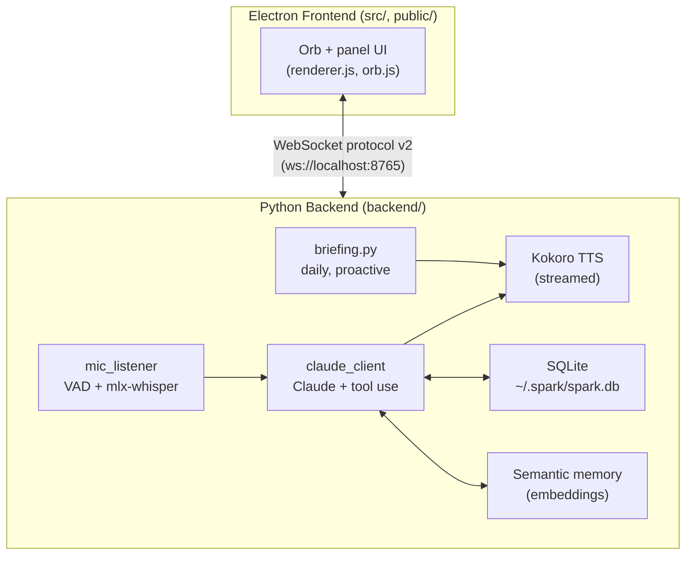

# Spark

A voice assistant for macOS that lives in a small, floating, always-on-top orb. Talk to it, it transcribes you locally, thinks with Claude, and talks back — with tool use, memory across sessions, and a proactive morning briefing.

## Features

- **Local transcription** — [mlx-whisper](https://github.com/ml-explore/mlx-examples) (`whisper-large-v3-turbo`) running on Apple Silicon's GPU via Metal. Audio never leaves your machine to be transcribed.
- **Claude-powered replies** — streamed sentence-by-sentence so speech starts before the full reply finishes generating.
- **Tool use** — Claude can run shell commands, search files, open applications, and save/forget things to memory, gated by an allowlist-first risk classifier: anything not confidently recognized as safe asks for confirmation (voice or click) before running.
- **Neural TTS** — [Kokoro](https://github.com/hexgrad/kokoro), local and Apple-Silicon-friendly, with tap-to-interrupt.
- **Persistent memory** — conversation history survives restarts (SQLite), plus a separate semantic memory (local embeddings) for things explicitly worth remembering long-term.
- **Morning briefing** — once a day, proactively reads out your calendar, reminders, and the weather without being asked.
- **Reactive orb UI** — a three.js orb that animates with live mic/TTS amplitude, expands into a conversation panel, and hides itself automatically when Spark goes idle (reappears the moment you start talking again — the mic never actually stops listening).

## Architecture


```mermaid
flowchart TD
    subgraph Electron["Electron Frontend (src/, public/)"]
        UI["Orb + panel UI\n(renderer.js, orb.js)"]
    end
    subgraph Python["Python Backend (backend/)"]
        Mic["mic_listener\nVAD + mlx-whisper"] --> Claude["claude_client\nClaude + tool use"]
        Claude --> TTS["Kokoro TTS\n(streamed)"]
        Claude <--> Store["SQLite\n~/.spark/spark.db"]
        Claude <--> Memory["Semantic memory\n(embeddings)"]
        Briefing["briefing.py\ndaily, proactive"] --> TTS
    end
    UI <-->|"WebSocket protocol v2\n(ws://localhost:8765)"| Python
```

The two halves only ever talk over a versioned WebSocket protocol (`backend/protocol.py`) — the Electron app spawns the Python backend as a child process (`src/main.js`) and everything else flows through that socket. See [`docs/SPARK_V2_SPEC.md`](docs/SPARK_V2_SPEC.md) for the full phase-by-phase implementation history and design rationale.

## Requirements

- **macOS on Apple Silicon** — `mlx-whisper` requires Metal; there's no Intel/Windows/Linux support.
- **Node.js** 18+ (tested with 22).
- **Python 3.11** (used to create the backend's virtualenv).
- An **Anthropic API key** ([console.anthropic.com](https://console.anthropic.com/)).

## Setup

```bash
git clone https://github.com/VivekKamisetty/Spark-Voice-Assistant.git
cd Spark-Voice-Assistant

# 1. Frontend dependencies
npm install

# 2. Backend virtualenv — must live at backend/whisper-env (src/main.js
#    launches the app with this exact path)
cd backend
python3.11 -m venv whisper-env
source whisper-env/bin/activate
pip install -r requirements.txt
cd ..

# 3. API key
cp backend/.env.example backend/.env
# then edit backend/.env and set ANTHROPIC_API_KEY
```

The first launch downloads the Whisper and Kokoro model weights, which takes a little longer than subsequent ones.

## Running it

```bash
npm run start
```

This launches the Electron app, which in turn spawns the Python backend for you (see `startSparkBackend` in `src/main.js`) — there's nothing else to run separately. macOS will prompt for microphone access the first time; grant it, or Spark won't hear anything.

Once it's up: the orb sits in the top-right corner, quietly listening. Speak normally — no wake word is needed today, just talk. It goes visually idle (hides itself) after 45 seconds of no input, and reappears the moment you speak again.

Quit with the window's own controls, or however you'd normally quit a macOS app — Spark shuts down the backend cleanly and releases the microphone when it does.

## Configuration

- **`backend/.env`** — `ANTHROPIC_API_KEY` (required), `SPARK_VOICE_MODE` (optional: `brief` / `full` / `muted` — see `backend/.env.example`).
- **`~/.spark/config.json`** — morning-briefing settings (enabled/disabled, cached location). No in-app UI for this yet; edit the JSON directly.
- **`~/.spark/spark.db`** — SQLite conversation history. Say "clear history" to wipe it (with confirmation).

## Project structure

```
src/main.js              Electron main process — window, IPC, spawns the backend
public/                  Renderer: index.html, renderer.js, orb.js (three.js), style.css
backend/
  spark_whisper_mic.py   Entry point — VAD/Whisper loop, state machine, main()
  claude_client.py       Claude conversation + tool use
  tts_engine.py          Kokoro (primary) / pyttsx3 (fallback) TTS, behind one interface
  ws_server.py           WebSocket hub (backend ↔ frontend)
  protocol.py            Versioned message shapes shared by both sides
  store.py                SQLite persistence
  memory.py               Semantic memory (embeddings)
  briefing.py             Morning briefing (calendar/reminders/weather)
  confirmation_gate.py    Shared confirm-before-acting flow (voice or click)
  risk_classifier.py      Allowlist-first risk classification for shell commands
  tests/                  pytest suite
docs/
  SPARK_V2_SPEC.md         Full implementation spec, phase by phase
  E2E_TEST_SCRIPT.md       Manual end-to-end test script
```

## Testing

```bash
cd backend
./whisper-env/bin/python -m pytest tests/ -q
```

## Known limitations

- macOS + Apple Silicon only.
- No wake-word/ambient always-listening mode yet — you start it with `npm run start`, and from then on it's actively listening (just hidden when idle) until you quit it.
- No real acoustic echo cancellation — Spark mutes its own mic input while speaking to avoid hearing itself, plus a tap-to-interrupt button, rather than true barge-in.

## License

ISC — see [`LICENSE`](LICENSE).
