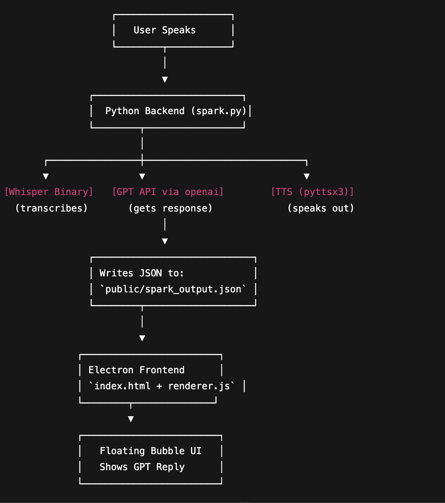

# Spark-Voice-Assistant

## 🔧 Setting up Whisper.cpp locally

1. Clone whisper.cpp:
   ```bash
   git clone https://github.com/ggerganov/whisper.cpp.git whisper
   cd whisper
   cmake -B build -DWHISPER_SDL2=ON -DGGML_METAL=OFF
   cmake --build build --config Release

2. Download a model:
    ```bash  
    ./models/download-ggml-model.sh base.en

3. Test:
    ```bash
    ./build/bin/whisper-stream -m models/ggml-base.en.bin -t 4 --no-gpu -c 1

Spark uses whisper-stream from this repo for local mic transcription.

## High-Level Architecture Diagram

