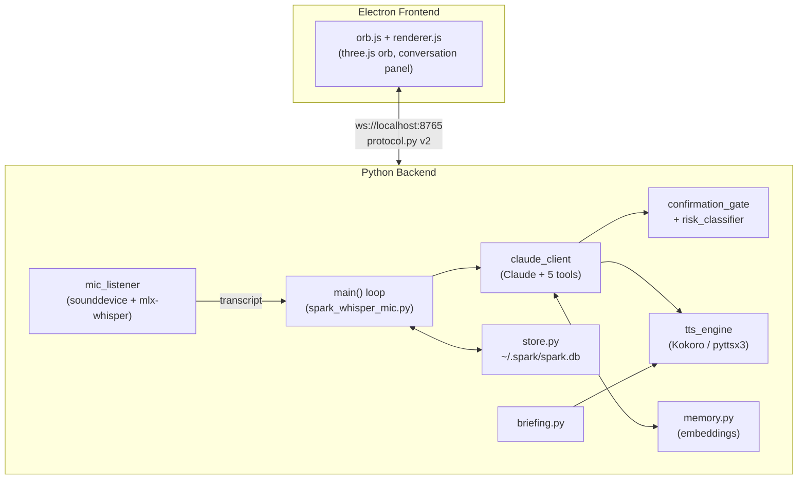

# Spark — Codebase Guide

A module-by-module deep dive into how Spark actually works today. Read this if you want to understand or modify the code. For *why* things ended up this way phase-by-phase (the development history, tradeoffs considered, and acceptance criteria each phase was built against), see [`SPARK_V2_SPEC.md`](SPARK_V2_SPEC.md) — this document describes the current end state; the spec describes how it got here. For a manual pass over the running app, see [`E2E_TEST_SCRIPT.md`](E2E_TEST_SCRIPT.md).

## Contents

1. [The big picture](#1-the-big-picture)
2. [Process boundary & startup sequence](#2-process-boundary--startup-sequence)
3. [The WebSocket protocol](#3-the-websocket-protocol)
4. [Audio capture & voice activity detection](#4-audio-capture--voice-activity-detection)
5. [The conversation turn lifecycle](#5-the-conversation-turn-lifecycle)
6. [Claude & tool use](#6-claude--tool-use)
7. [Safety: risk classification & confirmation gate](#7-safety-risk-classification--confirmation-gate)
8. [Text-to-speech](#8-text-to-speech)
9. [Persistence & memory](#9-persistence--memory)
10. [Morning briefing](#10-morning-briefing)
11. [Frontend: the Electron shell](#11-frontend-the-electron-shell)
12. [Frontend: the renderer & orb](#12-frontend-the-renderer--orb)
13. [Testing](#13-testing)

---

## 1. The big picture

Spark is two OS processes that only ever talk to each other over a WebSocket:

- **The Python backend** (`backend/`) does everything that isn't drawing pixels: it owns the microphone, runs Whisper transcription, talks to Claude, runs tool calls, synthesizes speech, and persists history. It is a single long-running script (`spark_whisper_mic.py`) with a handful of background threads — there is no web framework, no request/response cycle, just one process reacting to audio and WebSocket messages as they arrive.
- **The Electron frontend** (`src/`, `public/`) is a small, always-on-top, frameless window containing a reactive three.js orb and a collapsible conversation panel. It has no logic of its own beyond rendering whatever the backend tells it and forwarding user input (typed text, clicks, interrupts) back over the socket.

Neither side can see into the other's memory. Every single thing that changes on screen — the orb's color, a new sentence of a reply, a confirmation prompt — arrives as one specific message type defined in `backend/protocol.py` and handled by one specific `case` in `public/renderer.js`'s `handleSparkMessage`. If you're trying to trace "how does X end up on screen," that dispatch table is almost always the fastest way in.



## 2. Process boundary & startup sequence

`src/main.js` is the actual entry point of the whole app (`npm run start` runs `electron src/main.js`). On `app.whenReady()` it does two things: creates the `BrowserWindow` (see [§11](#11-frontend-the-electron-shell)) and spawns the Python backend as a child process:

```js
spawn('arch', ['-arm64', pythonPath, 'spark_whisper_mic.py'], { cwd: backendDir })
```

Two details worth knowing if you're debugging startup:
- `arch -arm64` forces native execution — this Electron/Node install runs under Rosetta on Apple Silicon, and a translated (x86_64) parent process spawns children in x86_64 by default, which crashes `torch` (an mlx-whisper dependency, installed arm64-only).
- `cwd: backendDir` matters beyond just running the right script: `claude_client.py`, `memory.py`, and `briefing.py` all call `load_dotenv()` with no arguments, which resolves `.env` relative to the process's *working directory*, not the script's location. Run the backend from anywhere else and it silently won't find your API key.

Inside `spark_whisper_mic.py`, a lot happens at **module level** — i.e. once, top-to-bottom, before `main()` is ever called:

1. `_prefetch_briefing` starts on a background thread *immediately*, as the very first thing — before anything else in this list. Gathering the morning briefing (two `osascript` calls, a weather API call, one Claude call) is entirely network/IO-bound, so starting it this early means it overlaps with the CPU/GPU-bound model loading below instead of stacking after it.
2. `KokoroTTSEngine()` loads the TTS model (falls back to `Pyttsx3TTSEngine` if unavailable).
3. `ws_server.start()` brings up the WebSocket server (see [§3](#3-the-websocket-protocol)).
4. `mlx_whisper.transcribe()` runs once on a dummy silent buffer, purely to force model weights to load now rather than on the first real utterance.
5. `calibrate_vad_threshold()` records 2 seconds of ambient audio via `sd.rec()` and derives a noise-floor threshold (see [§4](#4-audio-capture--voice-activity-detection)).

Only after all of that does `main()` run: it opens the SQLite connection, starts a session row, joins the briefing-prefetch thread (which — because of the overlap above — has usually already finished), delivers the briefing if one's due, starts the `mic_listener` and `incoming_message_watcher` threads, broadcasts `"listening"`, and enters its own loop, which just polls a `transcript_queue` for whatever `mic_listener` or the frontend puts there.

## 3. The WebSocket protocol

`backend/ws_server.py` is a thin hub: since the rest of the backend is synchronous (`threading`, blocking calls, plain `queue.Queue`) but the `websockets` library is asyncio-based, it runs its own asyncio event loop on a background thread. The rest of the codebase never touches asyncio directly — it just calls two functions:

- `ws_server.broadcast(message: dict)` — thread-safe, fire-and-forget, sends to every connected client (there's normally exactly one: the Electron renderer). A no-op if nobody's connected yet, so callers never need to check.
- `ws_server.incoming_queue` — a plain `queue.Queue` that `incoming_message_watcher` (in `spark_whisper_mic.py`) drains for messages the frontend sends back.

`backend/protocol.py` defines every message shape as a small factory function (`state_message`, `transcript_message`, etc.), each stamping `{"v": 2, "type": ...}`. Nothing constructs a raw dict by hand elsewhere in the codebase — this is the single place that would need to change to add a v3.

| Direction | Type | Purpose |
|---|---|---|
| → frontend | `state` | One of `idle`, `listening`, `thinking`, `speaking`, `awaiting_confirmation`, `calibrating` — drives the orb's color and the panel's idle-hide behavior. |
| → frontend | `amplitude` | Per-block bass/mid/high energy, `source: "mic"` or `"tts"`, throttled to ~30Hz — drives the orb's live shader displacement. |
| → frontend | `transcript` | A user utterance (voice or typed), `partial` reserved for future incremental ASR (currently always `false`). |
| → frontend | `assistant_chunk` | One sentence of a streaming reply, with a sequence `index`. |
| → frontend | `assistant_done` | Reply finished; carries `show_popup` for multi-line replies. |
| → frontend | `speech_started` | Fired the instant a given sentence *index* actually starts playing (not when generated) — lets the panel highlight the currently-spoken sentence. |
| → frontend | `tool_activity` | `running`/`done`/`error` for a tool call, with a short human-readable summary. |
| → frontend | `confirmation_request` / `confirmation_resolved` | Risk-gated action needs a yes/no (see [§7](#7-safety-risk-classification--confirmation-gate)). |
| → frontend | `briefing` | The morning briefing text, rendered as its own labeled bubble. |
| → backend | `text_input` | Typed fallback input; processed identically to a voice transcript. |
| → backend | `interrupt` | Tap-to-interrupt — stop whatever's currently speaking. |
| → backend | `confirmation_response` | A chip click resolving a pending confirmation. |

Per the v2 contract, both sides must ignore unrecognized message types rather than error — `protocol.parse_incoming` returns `None` for anything it doesn't recognize, and `renderer.js`'s `handleSparkMessage` has a `default: break` case.

## 4. Audio capture & voice activity detection

`mic_control.py` is deliberately tiny and holds one piece of shared, cross-module state: `should_listen`. It's split from *muting* on purpose — `mute_microphone()`/`unmute_microphone()` also shell out to `osascript` to change the actual **macOS system input volume**, because Spark has no acoustic echo cancellation and would otherwise hear its own TTS output as if it were the user talking. `should_listen` is the cheap in-process gate `mic_listener` checks every block; the OS-level mute is the actual belt-and-suspenders fix. This module lives on its own (not in `spark_whisper_mic.py`) purely to avoid a circular import — `confirmation_gate.py` and `claude_client.py` both need it too.

`mic_listener()` (in `spark_whisper_mic.py`) is the real work:

1. Resolves the input device by name (`"MacBook Pro Microphone"`, hardcoded — see [Known limitations](../README.md#known-limitations)), falling back to device 0 if not found.
2. Opens a `sounddevice.InputStream` and pulls raw blocks off a queue that the stream's own callback fills.
3. For each block: computes `max_amplitude`, and if it clears `vad_threshold` *and* `mic_control.should_listen`, appends the block to the current utterance and marks speech as detected.
4. Once speech has started, keeps appending blocks through a **grace period** even after the volume dips back under threshold — short words trail off in volume before they're actually finished, and only appending over-threshold blocks used to truncate them to a handful of milliseconds. The utterance only actually ends once `max_silence_time` (1s) of continuous sub-threshold audio has passed, or a hard `max_recording_time` (10s) safety cap is hit.
5. Post-capture, trims the tail back down to ~200ms after the last genuinely loud moment — the grace period above adds up to a full second of near-silent padding, which by volume alone pushes Whisper toward its classic hallucination on quiet clips ("Thank you.").
6. Runs `mlx_whisper.transcribe()`, then filters the result using Whisper's own confidence signals rather than the text itself: `no_speech_prob > 0.6` or `temperature >= 0.8` both discard the result as noise/garble. A fixed `POLITE_PHRASES` set (`"thank you"`, `"ok"`, etc.) is also dropped — these are exactly what Whisper hallucinates on quiet/noisy clips with no real speech — *unless* a confirmation is currently pending, since `"yes"`/`"no"` need to get through in that case.
7. If a confirmation is pending (`confirmation_gate.is_pending()`), the text is routed there via `offer_voice_text()` instead of the normal `transcript_queue` — this is how a spoken "yes" resolves a risk-gated tool call.

`vad_threshold` is a single global number set once at startup by `calibrate_vad_threshold()` (2 seconds of `sd.rec()` against ambient room noise) and never recalculated — a session that starts in a quiet room and later gets noisy doesn't re-adapt.

`audio_bands.py` is a separate concern: a cheap per-block FFT (bass/mid/high band energy, not full spectral analysis) shared by both `mic_listener` and `KokoroTTSEngine._play` to drive the orb's shader — since no raw audio stream reaches the Electron renderer (mic audio never leaves Python; TTS plays natively via `sounddevice`), this has to be computed here rather than via a browser-side `AnalyserNode`.

## 5. The conversation turn lifecycle

`main()`'s loop is intentionally simple: poll `transcript_queue`, and if there's something there, process it as one full turn. Every path through a turn ends by calling `start_idle_timer(45)` again, which — after 45 seconds with no new turn — fires `write_status("inactive")` (translated to the protocol's `"idle"` state). The window-hiding behavior described in [§12](#12-frontend-the-renderer--orb) is driven entirely by that one state transition; the mic itself never stops listening, idle or not.

Special-cased before the general path:
- **`"clear history"`** (and close variants) triggers `confirmation_gate.request_confirmation` directly, bypassing Claude entirely, then wipes `chat_history` and the `messages` table on confirmation.
- **Empty/noise-only** and **polite-only** transcripts (typed input only — voice input is already filtered inside `mic_listener`) are dropped without reaching Claude.

Everything else goes to `process_claude_turn(line, chat_history)`, which is the trickiest piece of concurrency in the codebase:

- Claude's streaming call (`route_claude_reply`, [§6](#6-claude--tool-use)) runs on its own thread (`run_claude`), because generation and speech playback need to happen concurrently — speech should start on the first completed sentence, not wait for the whole reply.
- Each completed sentence is handed to `on_sentence`, which does double duty: it applies the `---DETAIL---`/`SPARK_VOICE_MODE` split (only the headline before the marker is ever spoken in the default `"brief"` mode; everything is always shown in the panel regardless), broadcasts `assistant_chunk` for display, and — if there's anything to actually speak — pushes `(index, text, done_event)` onto `sentence_queue`.
- The **calling** thread (still `main()`, blocked inside `process_claude_turn`) consumes `sentence_queue` as a generator and feeds it straight into `tts_engine.speak_stream()`, which plays each chunk in order and fires `speech_started` broadcasts per index as they start.
- `done_event` (a `threading.Event`, one per chunk) is how `confirmation_gate.request_confirmation` knows a prompt has *actually finished being spoken*, not just been handed off to the TTS consumer — this specific mechanism exists because a fast "yes" used to resolve a confirmation while the prompt was still audibly mid-sentence (see [§7](#7-safety-risk-classification--confirmation-gate)).

On interrupt (`tts_engine.stop()`, triggered by the frontend's stop button or a `interrupt` message), `speak_stream` returns early but `process_claude_turn` still `.join()`s the Claude thread before returning — the audible interruption is immediate, but the reply is still persisted once generation actually finishes, since only `main()`'s thread is allowed to touch the shared SQLite connection.

Every real turn is written to `store.py` (user message, assistant reply, and a one-line summary of every tool call), and every 15 turns (`memory.EXTRACT_EVERY_N_TURNS`) plus once at shutdown, the recent transcript is sent through `memory.extract_and_store` to pull out anything durable-sounding.

## 6. Claude & tool use

`claude_client.py`'s `route_claude_reply` is the only place that talks to the Anthropic API for regular conversation (as opposed to `memory.py`'s and `briefing.py`'s own one-shot calls for extraction/composition). Three things worth understanding about it:

**Streaming + sentence splitting.** `client.messages.stream(...)` yields a raw text delta stream; `sentence_splitter.split_into_sentences` turns that into complete sentences as soon as each one's boundary (`.`/`!`/`?` followed by whitespace) is seen, with one special case — it won't split on a bare digit followed by a period (`"1."`), since that's almost always a numbered-list marker, not an abbreviated sentence end, and splitting there would tear the marker away from its own item text.

**The tool-use loop.** If `response.stop_reason == "tool_use"`, every `tool_use` block in the response is dispatched through `process_tool_call`, each result fed back to Claude as a `tool_result`, and the whole cycle repeats — capped at `MAX_TOOL_ITERATIONS` (8) so a persistently failing approach fails gracefully instead of Claude silently improvising forever. Each tool call is broadcast as `tool_activity` (`running` then `done`) so the panel shows live progress, and logged with its actual result (not just the tool name) to `tool_calls_log` for the SQLite audit trail.

**The system prompt** is worth reading directly in `claude_client.py` — a few of its instructions exist because of specific observed failures, not just style preference: Claude is told never to narrate that it's about to use a tool (the UI's `tool_activity` line already covers that, so it reads as redundant filler spoken aloud), to always structure replies as a short spoken headline optionally followed by `---DETAIL---` and more (this is what `on_sentence` in [§5](#5-the-conversation-turn-lifecycle) splits on), and to use `osascript` directly rather than third-party CLI tools for Calendar/Reminders (those often aren't installed on a fresh machine).

The five tools, each just a thin wrapper around a real macOS operation:

| Tool | What it does | Confirmation? |
|---|---|---|
| `execute_shell_command` | `subprocess.run(..., shell=True)`, 45s timeout, output truncated to 500 chars | If `risk_classifier.needs_confirmation()` says so — see [§7](#7-safety-risk-classification--confirmation-gate) |
| `search_files` | `find <dir> -name <pattern> -type f`, capped at 20 results | Never (read-only) |
| `open_application` | `open` / `open -a`, handles URLs, paths, and app names | Never |
| `remember_this` | Embeds and stores a fact via `memory.save_memory` | Never (low-risk write) |
| `forget` | Finds the best-matching memory, then deletes it | Always (destructive) |

A screenshot-vision path exists too: if `screenshot_enabled` and the prompt contains a visual keyword (`"screenshot"`, `"on my screen"`, etc.), `screencapture -x` runs first and the image is attached to the Claude message as base64. If that fails because Screen Recording permission hasn't been granted (`screencapture` exits non-zero or writes an empty file), Claude is told about the *specific, fixable* reason rather than silently getting no image — so it can tell the user how to grant it instead of implying it can never see the screen.

## 7. Safety: risk classification & confirmation gate

These two modules exist because of a real incident earlier in the project: a misheard "yes" let Claude use `execute_shell_command` to kill Spark's own Electron process, with no gate at all in front of it.

**`risk_classifier.py`** is deliberately **allowlist-first**, not blocklist-first — the project's own reasoning (worth reading verbatim in the module docstring) is that a blocklist of dangerous patterns is inherently incomplete (`curl | sh`, `chmod`, a forced `git push` all slip past an `rm`/`sudo`/`kill` blocklist unlisted). `needs_confirmation(command)` returns `True` unless the command's base binary is in a narrow `SAFE_COMMANDS` set (`ls`, `cat`, `grep`, `ping`, etc., all read-only) *and* none of `|;&\`$<>` appear anywhere in it (any of those can chain, redirect, or substitute in extra behavior beyond whatever the base command alone would do). `osascript` gets its own narrower check — a regex for mutating verbs (`set`, `delete`, `move`, `do shell script`, ...) — since Spark is explicitly told to use it for everyday Calendar/Reminders *reads*, and gating every single one of those would make normal use annoying.

**`confirmation_gate.py`** is the shared blocking flow both `spark_whisper_mic.py` (clear-history) and `claude_client.py` (risky tool calls) route through. `request_confirmation(prompt, risk, options, speak_fn)`:

1. Assigns a UUID, broadcasts `confirmation_request`, and speaks the prompt via `speak_fn` (passed through rather than opening a second concurrent TTS call — see [§5](#5-the-conversation-turn-lifecycle)'s `done_event` mechanism, which this function waits on directly when available, rather than a word-count time estimate).
2. **Explicitly unmutes the mic** right before waiting for an answer. This one line fixes a subtle, previously-broken flow: whatever spoke the prompt already muted the mic on its first sentence and normally doesn't unmute again until the *entire* turn finishes — which can't happen until this very confirmation resolves. Without the explicit unmute here, a real spoken "yes" would arrive as a near-silent clip Whisper had no chance of transcribing.
3. Blocks on a `queue.Queue` that either `offer_response()` (a chip click, routed via `incoming_message_watcher`) or `offer_voice_text()` (routed via `mic_listener`, whenever `is_pending()`) can push into — "first response wins" between the two input paths.
4. Resolves an answer against `CONFIRM_PHRASES`/`DECLINE_PHRASES` (whole-word regex match, not exact-string match, so natural phrasing like "Okay, go ahead." still resolves) — ambiguous or unrelated speech is ignored and the wait continues. A full timeout (default 30s) counts as a decline, never as an implicit yes.

## 8. Text-to-speech

`tts_engine.py` defines one interface, `TTSEngine.speak_stream(text_chunks) -> bool`, with two implementations swappable behind it. Each item in `text_chunks` can be a plain string, `(index, text)`, or `(index, text, done_event)` — the index drives `speech_started` broadcasts, the event is set once that specific chunk has genuinely finished playing (see [§5](#5-the-conversation-turn-lifecycle)/[§7](#7-safety-risk-classification--confirmation-gate)).

**`KokoroTTSEngine`** (primary, chosen after a direct side-by-side listening comparison against pyttsx3) synthesizes each chunk via Kokoro's `KPipeline`, then plays it through a `sounddevice.OutputStream` whose callback both feeds audio frames *and* computes/broadcasts `audio_bands` energy per block (mirroring `mic_listener`'s ~30Hz throttle) so the orb reacts to Spark's own voice while speaking. Interruption is a `threading.Event` checked both between chunks and mid-playback-callback (raising `sd.CallbackStop()` to cut off immediately, not just after the current chunk finishes).

**`Pyttsx3TTSEngine`** is the fallback if Kokoro's dependencies aren't installed. No amplitude broadcasting — pyttsx3 doesn't expose the audio buffer, only an opaque call into the OS synthesizer. It also creates a fresh `pyttsx3.init()` engine per utterance rather than reusing one long-lived instance, working around a known macOS `NSSpeechSynthesizer` issue where the run loop silently stops producing audio after repeated `say()`/`runAndWait()` cycles.

## 9. Persistence & memory

`store.py` is a thin, deliberately synchronous SQLite wrapper — every function takes an explicit `sqlite3.Connection` rather than managing one internally. **The one convention that matters most here**: the module-level shared connection (`spark_whisper_mic.py`'s `_db`) is only ever safe to use from `main()`'s own thread, since `sqlite3` connections aren't safe to share across threads. Anything that needs DB access from a different thread (tool handlers in `claude_client.py`, which run on the streaming background thread) opens and closes its own short-lived connection via `store.init_db()` instead.

Three tables: `sessions`, `messages` (every user/assistant turn, plus `'tool'`-role rows logging actual commands and results), and `memories` (schema reserved from Phase 1, actually used starting Phase 5). `load_recent_messages()` is worth understanding if you touch it — it excludes `'tool'` rows entirely and trims both ends of the result until it starts on `'user'` and ends on `'assistant'`, because Claude's API requires strict alternation and a `LIMIT`-based query can otherwise land mid-pair.

**`memory.py`** is a small local RAG layer: `sentence-transformers` (`all-MiniLM-L6-v2`, loaded lazily on first use, not at import time) embeds facts into the `memories.embedding` BLOB column; retrieval and dedup are both brute-force cosine similarity linear scans (fine at the scale one user's memory table will ever reach — no vector index). Two independent thresholds matter: `DEDUP_SIMILARITY_THRESHOLD` (0.9 — only near-duplicate phrasings of the *same* fact get skipped on write) and `RETRIEVAL_SIMILARITY_THRESHOLD` (0.35 — how relevant a memory must be to the *current* prompt to be worth spending system-prompt tokens on). `extract_and_store` asks Claude to pull durable facts out of a transcript using structured output (`output_config: {"format": {"type": "json_schema", ...}}`) rather than parsing free text.

## 10. Morning briefing

`briefing.py` is Spark's one piece of proactivity, and it's narrow by design: once a day, on the first real trigger (see below), Spark opens with a short spoken summary instead of waiting to be asked. State lives in `~/.spark/config.json` (`briefing_enabled`, `last_briefing_date`, a cached `location`) — there's no in-app UI to edit this yet.

Two trigger paths, both gated by `should_deliver_briefing()` (enabled, not already delivered today, and past `MIN_BRIEFING_HOUR` = 5am local):
- **App launch** — the preferred path. `prepare_briefing_text()` (gather + compose, *not* mark-delivered) runs on a background thread starting the instant the module loads, well before Kokoro/Whisper warmup even begins (see [§2](#2-process-boundary--startup-sequence)); `main()` joins that thread and calls `deliver_prepared_briefing()` (mark done, broadcast, speak) once warmup has also finished — deliberately *before* `mic_listener` starts, so nothing said while the briefing is still gathering or speaking gets silently dropped.
- **First real utterance of a new day**, for a session that's been running since before midnight — `maybe_deliver_briefing()` (an all-in-one convenience wrapper) is called as a no-op-on-any-normal-day fallback right before every turn is processed in `main()`'s loop.

Gathering itself (`_gather_briefing_inputs`) runs calendar, reminders, and weather **concurrently** via a `ThreadPoolExecutor`, since they're independent and the calendar lookup alone can be slow. That calendar lookup has real, hard-won complexity worth knowing about if you touch it: querying every calendar's events in one combined AppleScript `whose`-filtered query was found live to reliably take the *entire* 45-second timeout, because `Calendar.app`'s date-range filter isn't indexed and has to evaluate every occurrence of every recurring event — holiday-subscription calendars (years of annually-recurring all-day entries) are the pathological case. The fix querying each calendar **separately**, with calendars sorted so non-"holiday"-named ones go first, a fixed per-calendar timeout, and a hard total time budget across all calendars combined — a slow calendar degrades to "its events are missing" rather than blowing the whole briefing's budget. Concurrency was tried and made this *worse*, not better: `Calendar.app` appears to serialize its own Apple Events handling internally, so concurrent client requests contend with each other rather than actually running in parallel.

Weather is a single keyless Open-Meteo call, location resolved via IP geolocation (`ipapi.co`, falling back to `ip-api.com` if rate-limited) and cached in `config.json` after the first successful lookup.

## 11. Frontend: the Electron shell

`src/main.js` owns exactly one `BrowserWindow`, configured to feel like a HUD rather than an app: `frame: false`, `transparent: true`, `vibrancy: 'under-window'` (real macOS frosted glass), `alwaysOnTop` + `setVisibleOnAllWorkspaces`, `skipTaskbar: true` (no Dock icon, no entry in the Cmd-Tab switcher). Because there's no window frame to grab, `renderer.js` tracks mouse position itself and tells the main process which regions should actually be interactive via `set-mouse-events` — everywhere else, clicks fall straight through to whatever's behind Spark. `resize-window` is how the window's actual OS-level size follows the panel's spring-physics expand/collapse animation happening purely in the renderer.

Two more recent IPC handlers, `visibility-show`/`visibility-hide`, just call `win.show()`/`win.hide()` — driven by the renderer reacting to `state` messages (see [§12](#12-frontend-the-renderer--orb)) so the window disappears while Spark is idle and reappears the moment a new turn starts, without needing any backend changes.

The backend's lifecycle is tied to the window's: `startSparkBackend()` spawns it once on `whenReady`; if it exits unexpectedly the whole app quits rather than leaving a windowless zombie. The reverse holds too — `before-quit` calls `killSparkBackend()`, which sends `SIGTERM` first (the backend's own handler does a clean shutdown — unmuting the mic, persisting a final memory-extraction pass, ending the session) and escalates to `SIGKILL` after a 3-second grace period if it hasn't exited, so a hung backend can never outlive the app and squat on the WebSocket port for the next launch.

## 12. Frontend: the renderer & orb

`public/renderer.js` holds a single persistent WebSocket connection (`connectSparkSocket`, with exponential backoff reconnect) and one dispatch function, `handleSparkMessage`, mapping every protocol message type in [§3](#3-the-websocket-protocol) to a handler. A few things worth knowing:

- **Idle-hide.** `onStateChange(state)` — called only on an actual state *change*, not every broadcast — sends `visibility-hide` to the main process when `state === 'idle'`, `visibility-show` otherwise. This is the entire implementation of the window auto-hiding while Spark is idle; there's no backend involvement.
- **Latest-exchange-only transcript.** `renderUserTranscript` clears the panel's content on a fresh (non-partial-continuation) user message rather than accumulating full history — the panel is a live "what's happening right now" view, not a scrollback; full history lives in SQLite, not the DOM.
- **Sentence-level highlighting.** Each `assistant_chunk` becomes its own `.sentence` DOM element (not one continuously-reparsed blob), so `speech_started` can dim sentences already spoken and glow the one currently playing, independent of how far ahead generation/display has already run.
- **The panel itself** is a custom spring-physics height animation (`startSpring`, stiffness/damping constants, not a CSS transition) rather than a fixed open/closed toggle, so it visibly grows as a reply streams in. `resizeWindowToContent` translates that into an actual OS window resize by measuring the real rendered content bounds — earlier attempts that measured `#app`'s own box created a runaway feedback loop, since `#app` is bound to the window's current size.

`public/orb.js` is the reactive three.js orb — three meshes layered together (an outer noise-displaced membrane, a smaller lagged "core" that visibly catches up a beat later for a viscous/jelly look, and an additive-blended backside-only glow shell approximating bloom without a real postprocessing pass, since three's ESM-only postprocessing addons reliably hard-crashed this non-bundled `nodeIntegration` Electron setup). `setState(state)` picks a target color from a fixed palette (green=listening, blue=thinking, amber=speaking, pink=awaiting_confirmation); `setAmplitude(bass, mid, high)` sets targets the render loop continuously eases toward — nothing ever snaps between values.

## 13. Testing

```bash
cd backend
./whisper-env/bin/python -m pytest tests/ -q
```

Coverage is concentrated on the modules with real, non-obvious logic and no hardware dependency: `protocol.py` (message shape/validation), `store.py` (SQLite schema and thread-safety-respecting operations), `memory.py` (embedding dedup/retrieval thresholds), `confirmation_gate.py` (phrase resolution, timeout-as-decline), `risk_classifier.py` (allowlist edge cases), `sentence_splitter.py` (boundary detection including the numbered-list guard), `briefing.py` (config gating, calendar/reminders/weather composition), and `tts_engine.py` (interface contract). There's deliberately no automated coverage of the actual audio pipeline (`mic_listener`, live Whisper transcription, real TTS playback) or the Electron frontend — those are hardware-facing and real-time by nature, and are instead covered by manual live testing (see [`E2E_TEST_SCRIPT.md`](E2E_TEST_SCRIPT.md)).
